# LegalPlates Architecture Diagrams

## System Architecture Overview

## Document Processing Flow

## Template Matching Flow

## Prompt Evolution Stages

## Performance Optimization Flow

```mermaid
graph TD
    A[Document Upload] --> B[Parallel Processing]
    B --> C[Gemini AI Call]
    B --> D[Embedding Generation]
    B --> E[Duplicate Detection]
    
    C --> F[Combined API Call]
    F --> G[Variables + Template + Questions]
    
    D --> H[Vector Embeddings]
    E --> I{Duplicate Found?}
    I -->|Yes| J[Return Existing Template]
    I -->|No| K[Save New Template]
    
    G --> L[Template Ready]
    H --> L
    J --> L
    K --> L
    
    L --> M[Frontend Display]
    M --> N[Prefilled Form]
    N --> O[User Input]
    O --> P[Final Document]
```

## Key Features Architecture

