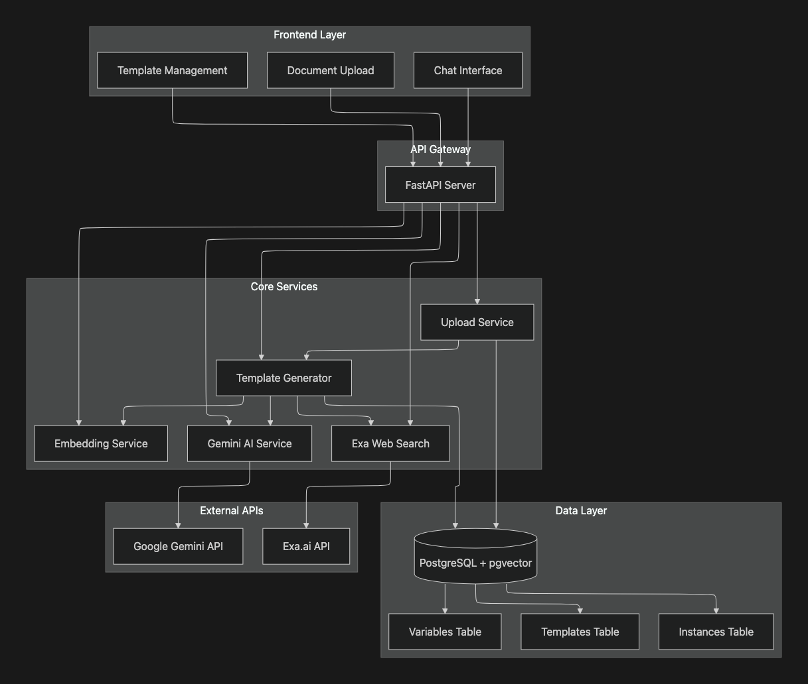

# LegalPlates Server

> **AI-Powered Legal Document Template Generation & Management System**

A sophisticated FastAPI backend that transforms legal documents into intelligent, reusable templates using advanced AI techniques including semantic search, variable extraction, and automated question generation.

## 🚀 Quick Start

### Prerequisites

- Python 3.13+
- PostgreSQL 12+ with pgvector extension
- Google Gemini API key (required)
- Exa.ai API key (optional, for web fallback)

### Installation

1. **Clone the repository**

2. **Create virtual environment**

   ```bash
   python -m venv venv
   source venv/bin/activate  # On Windows: venv\Scripts\activate
   ```

   The database is initialised itself, no need to add tables!

3. **Install dependencies**

   ```bash
   pip install -r requirements.txt
   ```

4. **Set up environment variables**

### Running the Server

```bash
# Development mode
uvicorn app.main:app --reload --host 0.0.0.0 --port 8000

# Production mode
uvicorn app.main:app --host 0.0.0.0 --port 8000
```

The API will be available at `http://localhost:8000`

### API Documentation

- **Interactive Docs**: `http://localhost:8000/docs`
- **ReDoc**: `http://localhost:8000/redoc`

## 🏗️ Architecture Overview

> **📊 Detailed architecture diagram
<p align="center">
  
</p>

### System Components

The LegalPlates system is built with a modern, scalable architecture featuring:

- **Frontend Layer**: Next.js application with real-time chat interface
- **API Gateway**: FastAPI server with comprehensive middleware
- **Core Services**: AI-powered document processing and template generation
- **Data Layer**: PostgreSQL with pgvector for semantic search
- **External APIs**: Google Gemini AI and Exa.ai integration

### Key Features Highlighted

🎯 **Smart Template Matching**: Semantic search with AI re-ranking  
🤖 **AI-Powered Extraction**: Advanced variable extraction using Gemini  
📝 **Intelligent Prefilling**: Auto-fill form fields from user queries  
🔄 **Web Fallback**: Generate templates from web sources when needed  
⚡ **Real-time Updates**: Server-Sent Events for live progress  
🎨 **Frontend-Optimized**: Bullet points instead of tables for better rendering  
⚡ **Performance Optimized**: 40-second template generation (down from 90+ seconds)  
🔍 **Duplicate Detection**: 90% similarity threshold with existing template reuse

## 🧠 Prompt Design Evolution

> **📚 Complete prompt evolution details are available in [PROMPT_EVOLUTION.md](PROMPT_EVOLUTION.md)**

The system's AI prompts have evolved through 6 key stages, each building upon the previous to create increasingly sophisticated and reliable document processing:

### 1. Role Prompting Foundation

**Goal**: Establish AI expertise and context

```python
# Before: Generic AI assistant
"You are a legal document templating expert."

# After: Specific role with experience
"You are a senior legal advocate who makes and edits legal documents for a living. 
Perform ALL these tasks in ONE response with the precision and expertise of a 
seasoned legal professional:"
```

### 2. Chain-of-Thought Variable Extraction

**Goal**: Ensure systematic and accurate variable identification

```python
# Structured extraction process
"""
TASK 1: EXTRACT VARIABLES
Extract variables following these rules:
❌ NEVER variable-ize: Statutory references, legal definitions, Acts/regulations, 
   mandatory legal language, boilerplate clauses
✅ ONLY variable-ize: Party-specific facts, case-specific details, 
   customizable terms, identifiers
"""
```

### 3. Guardrails Implementation

**Goal**: Prevent inappropriate content and ensure legal focus

```python
# Legal document validation
"""
CRITICAL REQUIREMENTS:
1. Document must be for legal purposes only
2. Require ISO dates, currency formats, and minimal regex for IDs where applicable
3. Ensure compliance with legal document standards
4. If the source doc contains mandatory statutory references, do not variable-ize statute text; only variable-ize party-specific facts
"""
```

### 4. Markdown Formatting Examples

**Goal**: Ensure consistent, frontend-friendly output

```python
# Detailed formatting instructions with examples
"""
TASK 2: GENERATE TEMPLATE BODY
- Convert numbered headings (1., 2.1, 3.1.1) to proper Markdown headings (# ## ### ####)
- Convert bullet points (a., b., i., ii., •, ○) to proper Markdown lists (- or 1.)
- **CRITICAL: Convert tabular data to simple bullet point lists (NO TABLES)**
- Remove page numbers and incomplete phrases
- Maintain proper formatting and structure

EXAMPLE OUTPUT:
# Service Level Agreement
**Last updated:** {{agreement_date}}

## Introduction
This Service Level Agreement ("SLA") applies to your access and use of...
"""
```

### 5. Artifact Removal

**Goal**: Clean up document noise and irrelevant content

```python
# Comprehensive cleanup instructions
"""
CRITICAL CLEANUP REQUIREMENTS:
- **REMOVE ALL PAGE NUMBERS:** Delete any standalone numbers at the end of paragraphs
- **REMOVE INCOMPLETE PHRASES:** Delete any incomplete sentences or phrases
- **REMOVE FOOTER TEXT:** Delete any text from document footers or headers
- **REMOVE RANDOM ARTIFACTS:** Clean up OCR errors and formatting artifacts
"""
```

### 6. Legal Document Classification

**Goal**: Ensure all outputs are legally appropriate

```python
# Document type validation and conversion
"""
LEGAL DOCUMENT CLASSIFICATION:
1. **Analyze document type:** Determine if it's already a legal document
2. **If non-legal:** Convert to appropriate legal template type
3. **If legal:** Proceed with standard processing
4. **Ensure legal compliance:** All outputs must be suitable for legal use

EXAMPLES:
- Business proposal → Service Level Agreement
- General contract → Professional Service Agreement
- Terms of service → Legal Terms and Conditions
"""
```

## 📊 Performance Metrics

- **Template Generation**: ~40 seconds
- **Duplicate Detection**: 90% similarity threshold

## 🛠️ Development

### Running Tests

```bash
# Run all tests
pytest

# Run with performance timing
pytest tests/test_api.py -v

# Run specific test categories
pytest tests/test_performance.py
```

## 📚 API Endpoints

### Core Endpoints

| Method | Endpoint | Description |
|--------|----------|-------------|
| `POST` | `/api/v1/upload` | Upload document and generate template |
| `GET` | `/api/v1/template` | List all templates (paginated) |
| `GET` | `/api/v1/template/{id}` | Get specific template details |
| `DELETE` | `/api/v1/template/{id}` | Delete template |
| `POST` | `/api/v1/draft/match-stream` | Find matching templates (SSE) |
| `POST` | `/api/v1/draft/questions` | Get questions with prefilled values |
| `POST` | `/api/v1/draft/generate` | Generate final document |

### Response Format

All API responses follow a consistent structure:

```json
{
  "error": false,
  "message": "Success message",
  "body": {
    // Response data
  }
}
```

## 🔧 Configuration

### Database Configuration

The system uses PostgreSQL with the pgvector extension for semantic search capabilities.

### AI Service Configuration

- **Gemini API**: Required for all AI operations
- **Exa API**: Optional, used for web fallback when no suitable templates are found
